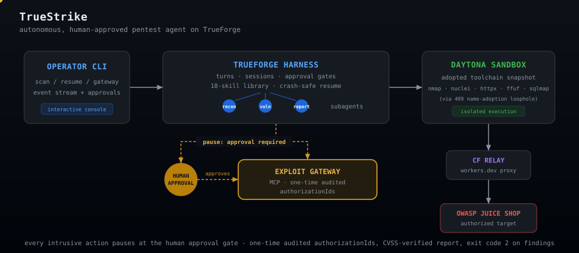

# TrueStrike

Autonomous, human-approved web pentest agent on
[TrueForge](https://github.com/truefoundry/trueforge). Point it at a target
you own: it recons the attack surface, proves vulnerabilities with working
PoCs in an isolated [Daytona](https://www.daytona.io/) sandbox, **pauses for
your approval before anything intrusive**, and writes a CVSS-scored pentest
report. Exit code 2 when findings exist - CI-friendly by design.



Built for the WeMakeDevs Agent Harness Hackathon (Aug 2026) by Shanu Kumawat
and Rishi Sulakhe. Docs: [project](docs/project.md) ·
[architecture](docs/architecture.md) · [demo target](docs/demo-target.md) ·
[review discipline](docs/qodo-workflow.md)

## What a scan actually does

A real engagement against the local [OWASP Juice Shop](docs/demo-target.md)
demo, run end to end by the agent:

- Provisions a **Daytona sandbox from a custom toolchain snapshot** (nmap,
  nuclei, httpx, ffuf, sqlmap - how that snapshot got past TrueForge's
  compile-time image pin is [a story](docs/architecture.md#sandbox-toolchain))
- Fans out **specialist subagents** (recon, per-class validation clusters,
  reporting) under a role-aware doctrine - the root agent never sends a
  target-facing request itself
- Reads an **18-pack skills library** (3 process packs + 15
  vulnerability-class references) on demand, straight from the sandbox
- **Pauses at the exploit gateway** for every intrusive action: TrueForge's
  approval gate stops the turn, the CLI prompts the operator, approval mints
  a one-time audited authorizationId
- Writes both report artifacts in the sandbox; the CLI downloads them,
  **recomputes every CVSS 3.1 score from its vector** (its own engine has
  caught the agent's arithmetic before), appends the approval audit trail,
  and exits 2 on findings

From that engagement's report (excerpt showing verified findings; full
artifact lands in `truestrike-runs/<session>/`):

| ID    | Finding                                                        | Severity     | CVSS |
| ----- | -------------------------------------------------------------- | ------------ | ---- |
| F-002 | SQLi authentication bypass (login), arbitrary account takeover | **Critical** | 9.8  |
| F-001 | SQLi in product search, full database read                     | High         | 7.5  |
| F-003 | Password hash disclosed in login JWT (MD5)                     | High         | 7.5  |
| ...   | _[additional confirmed findings in full report]_               | ...          | ...  |

_(Full scored findings list, validation vectors, and PoC transcripts in generated report)_

> The one intrusive action - executing the SQL-injection login bypass PoC -
> was routed through the exploit-approval gateway and executed only after
> explicit human approval (`authorizationId 30683ea2-...`). No destructive,
> write, or availability-affecting actions were performed.

Every score independently recomputed, every PoC executed.

## Quickstart

Prerequisites: Node >= 22, pnpm, Docker, a TrueForge server
(`npx @truefoundry/trueforge`) with a model provider and the Daytona sandbox
provider configured, and a Daytona API key.

```bash
pnpm install
cp .env.example .env          # fill in your keys - never commit .env
pnpm check                    # typecheck + lint + format + tests

# one-time: build the toolchain snapshot in Daytona (see docs/architecture.md)
node scripts/create-toolchain-snapshot.mjs   # from a trueforge checkout

# one-time: configure the 18 skills on your TrueForge server
node scripts/configure-skills.mjs

# run the demo target + relay (docs/demo-target.md), then:
pnpm truestrike gateway       # approval-gated MCP server (keep running)
pnpm truestrike scan <demo-url>
pnpm truestrike scan --resume # after a crash or disconnect
```

Exit codes: `0` clean, `1` error, `2` findings found.

## Safety model

- **Scope allowlist**: loopback only by default; the sole extension is
  `TRUESTRIKE_ALLOW_HOSTS` (used for the demo relay)
- **Isolation**: all execution in an ephemeral cloud sandbox, never your
  machine
- **Approval before intrusive**: the gateway makes intrusive actions
  structurally gated; every approval is one-time and audited
- **Honest reporting**: unproven hypotheses never enter the machine-readable
  findings; the agent once diagnosed a sandbox egress block from inside its
  cell, refused to relay through out-of-scope hosts, and reported exactly
  what it could not test

Never point TrueStrike at systems you don't own or lack written permission
to test.

## Qodo Code Review Evidence

Every substantive change went through a Qodo-reviewed pull request - 12 PRs,
all merged, none bypassed. Representative PR: **[PR #1 - CLI skeleton, scan
command, scope allowlist, SDK turn
streaming](https://github.com/Shanu-Kumawat/truestrike/pull/1)**.

What Qodo surfaced there and what we did about it: a High-severity
cancelled-turn exit-code bug (fixed), credential-in-URL disclosure (fixed by
rejecting such targets), a double-printed model reply (fixed), and two
findings we dismissed **with recorded reasons in the thread** - the scope
allowlist it wanted removed is the product's authorization model, and one
finding referenced pre-fix code (line-level evidence posted). PR #1 is the
day-one representative: Qodo was reviewing before our first line of
production code merged.

The standout is **[PR #11 - the skills
library](https://github.com/Shanu-Kumawat/truestrike/pull/11)**: fourteen
findings, the biggest forcing a **systematic security-boundary rewrite**
across all 15 skill packs (one uniform rule: detection probes flow free;
extraction, authentication attempts, state writes, and command execution go
through the approval gateway) - and its round 2 correctly caught us claiming
a fix that had not actually landed. Elsewhere on the trail: PR #7's review
pushed us from name-adoption trust to **definitive snapshot verification**
(boot a throwaway sandbox, execute nuclei from the snapshot), and PR #8's
round 1 caught audit-trail cross-contamination between engagements.
Roughly 47 findings raised across the 12 PRs: fixed, or dismissed on the
record with evidence. The full review history is readable on every PR.

## Upstream contributions

Building on TrueForge surfaced 18 documented findings and improvement
opportunities; the six with the cleanest confirmed evidence - including the
silent local-sandbox fallback and the compile-time image pin (plus the
name-adoption seam we used constructively) - are summarized in
[docs/upstream-findings.md](docs/upstream-findings.md) and queued for filing
upstream, with PRs offered for the docs-sized ones. We stress tested both
the harness and the reviewer; both made the product better.

## License

Apache-2.0
